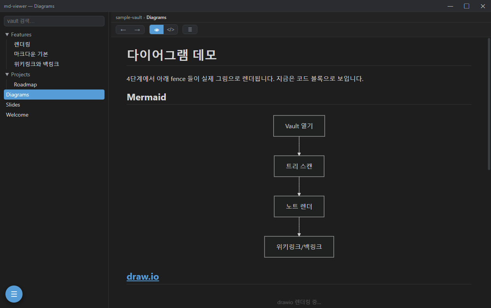
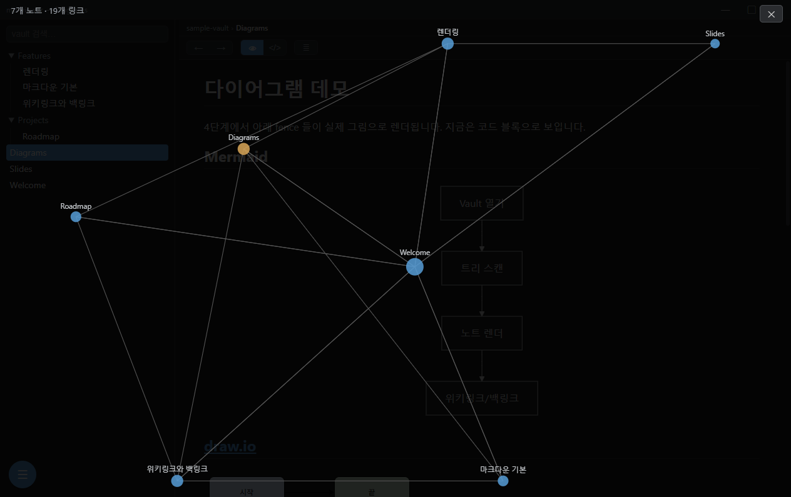
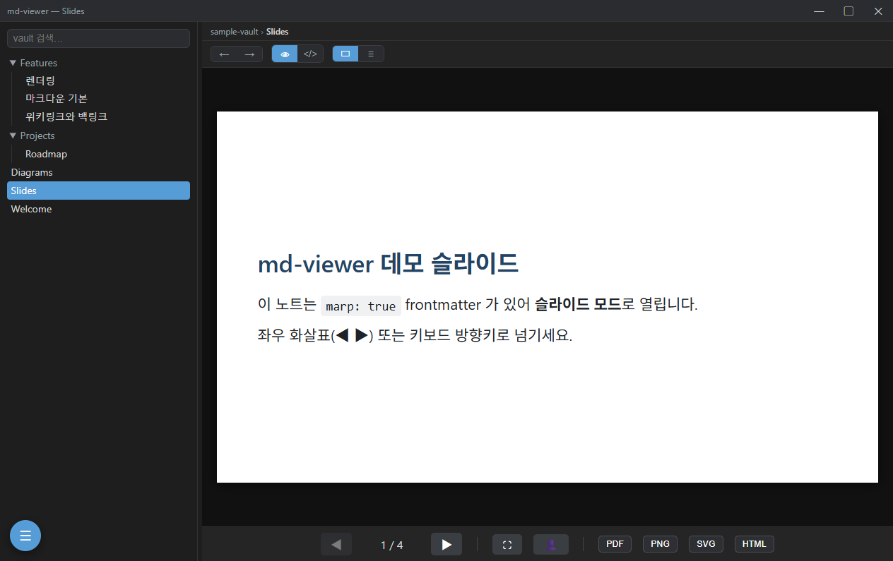
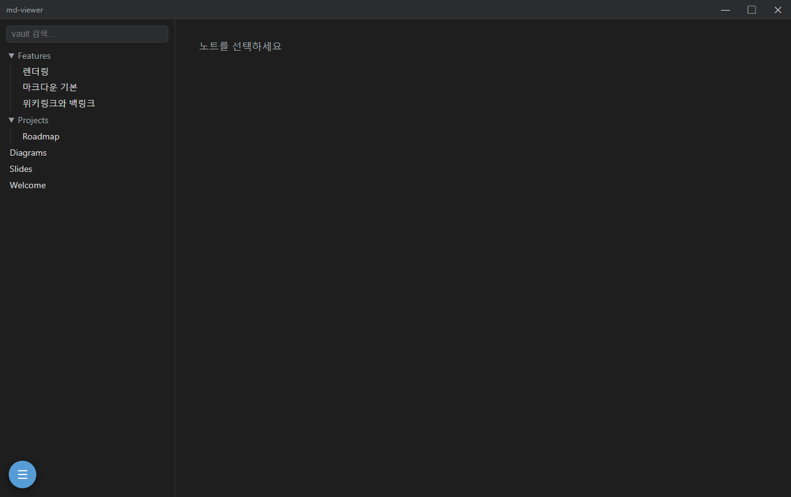
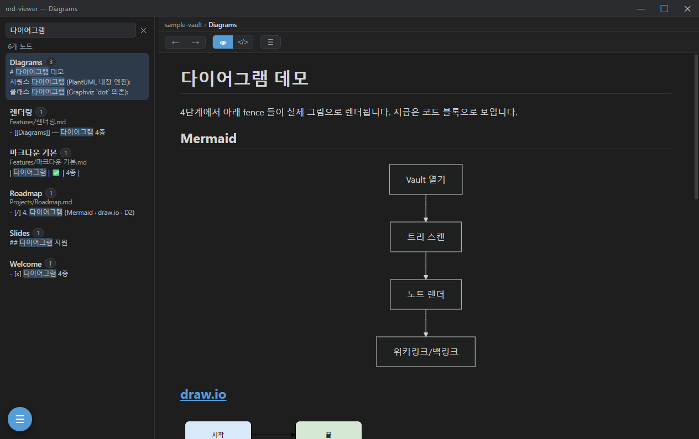

# md-viewer

> **폐쇄망에서 `git pull` 하나로 끝나는 Obsidian형 마크다운 뷰어.**
> 다이어그램 4종 · Marp 발표 · 그래프 뷰 · 전문 검색까지, 인터넷 없이 그대로.

사내 폐쇄망(외부 인터넷 차단) 환경을 위한 **자체완결** Markdown 뷰어입니다.
빌드만 인터넷 PC에서 하고, 폐쇄망에서는 받아서 실행만 합니다.

## 왜 md-viewer?

- **런타임 외부 의존 0** — 모든 라이브러리가 `vendor/` 에 포함. CDN·네트워크 불필요.
- **다이어그램 4종 오프라인** — Mermaid · draw.io · D2(WASM) · PlantUML(번들 JRE).
- **Marp 발표** — 전체화면 재생 · 발표자 뷰 · **청중 이중 창** · PDF/PNG/SVG/HTML export.
- **Obsidian 호환** — 위키링크 `[[…]]` · 백링크 · 그래프 뷰 · 임베드 · 태그.
- **전문 검색** — vault 본문 인덱스 + 하이라이트 + 매치 네비게이션.

## 스크린샷

| 다이어그램 4종 (오프라인) | 그래프 뷰 (노트 링크 시각화) |
|---|---|
|  |  |

| Marp 슬라이드 (발표 · Export) | 렌더링 (콜아웃 · 수식 · 코드) |
|---|---|
|  |  |

| 전문 검색 + 하이라이트 |
|---|
|  |

> 스크린샷은 `npx electron scripts/capture-screenshots.js` 로 sample-vault 기준 재생성.

## 설계 원칙

- **런타임 외부 의존 0** — 모든 라이브러리는 `vendor/` 에 포함되어 `git pull` 로 따라온다.
- **빌드는 외부 인터넷 PC에서만** — 폐쇄망 PC는 `git pull` + Electron 실행만.
- **Electron 채택** — Windows 10 다수 + WebView2 미보장 환경이라 Chromium 자체 번들 필요 (Tauri 아님).
- **보안 기본값** — contextIsolation/sandbox on, nodeIntegration off, 네트워크 차단(connect-src 'self'), 렌더 HTML DOMPurify 새니타이즈.

## 기능

**코어**
- vault 폴더 트리 탐색 + Markdown 렌더링 (markdown-it + DOMPurify)
- 위키링크 `[[노트]]` / `[[노트|별칭]]` / `[[노트#헤딩]]` (Obsidian 호환) + 백링크 패널
- 파일 변경 라이브 갱신 (`fs.watch`, 의존성 0)
- 로컬 이미지 (`mdv-res://` 커스텀 프로토콜로 vault 상대경로 서빙)
- GFM 체크박스 — 다단계 마커 `[ ]`/`[x]`/`[/]`/`[-]` (todo/done/doing/cancelled)

**전문(full-text) 검색**
- 사이드바 검색 + 결과 패널 (노트별 매치 횟수 배지, 스니펫 하이라이트)
- 본문 검색어 하이라이트 + 매치 네비게이션 (상단 바 `‹ n/m ›`, Enter/Shift+Enter, 첫 매치 자동 스크롤)
- main process 본문 인덱스 재사용 (in-memory, 렌더러로 본문 미전송)

**다이어그램**
- **Mermaid** · **draw.io**(보기 전용) · **D2**(WASM) — 렌더러에서 직접
- **PlantUML** — main process에서 `java -jar plantuml.jar` (설치본은 자동 번들)
- 렌더 결과 메모이즈 + 로딩 표시, mermaid 테마 선택

**Marp 슬라이드 모드** — frontmatter `marp: true` 노트를 슬라이드 덱으로
- 문서↔슬라이드 뷰 토글, export: **PDF · HTML · PNG · SVG** (오프라인)

**UI / UX**
- 커스텀 타이틀바(frameless, 최소화/최대화/닫기) + 좌하단 플로팅 메뉴(☰)
- 콘텐츠 상단 토글 바 — 렌더 ↔ 원본(raw, 라인번호) / (Marp) 문서 ↔ 슬라이드
- 노트 헤딩 접기/펼치기, 트리 depth 들여쓰기, 커스텀 스크롤바
- 사이드바 너비 조절(드래그 splitter, 더블클릭 리셋) · Ctrl+휠 확대/축소
- 최근 vault 리스트 + 시작 시 자동 열기
- 코드/원본 보기 CJK 정렬 monospace 폰트(NanumGothicCoding 번들)

**자동 업데이트** (인터넷 환경 — 패키징 설치본)
- GitHub Releases 를 주기적으로 확인(기본 6시간 + 시작 직후) → 새 버전 시 상단 배너 알림
- **"지금 업데이트"** 원클릭: 다운로드 → 앱 종료 후 헬퍼가 교체 → 자동 재시작 (검증·실패 시 롤백)
- 버전 건너뛰기, 설정 패널에서 현재/최신 확인 + "지금 확인"
- 네트워크 조회는 main 프로세스에서만 → 렌더러 CSP·오프라인 보안 모델 무훼손, 런타임 의존 0
- 소스/주기/토큰 재정의: `MDV_UPDATE_*` 또는 `mdv.config.json`. 발행 절차는 [DISTRIBUTION.md](DISTRIBUTION.md)

## 개발 (인터넷 되는 PC)

```bash
npm install        # dev 의존성
npm run vendor     # vendor/ 생성 (다운로드 + 번들)
npm start          # 앱 실행
npm test           # 단위 + 스모크 테스트
```

## 폐쇄망 배포

요약: 외부 PC에서 `npm run vendor` → 커밋/푸시. 폐쇄망에서 `git pull` +
Electron prebuilt 반입 후 `run.cmd`. PlantUML 은 `tools/` 에 JRE/jar 반입.

상세 절차는 **[DISTRIBUTION.md](DISTRIBUTION.md)** 참조.

## 구조

```
src/main/         Electron main process
  main.js           윈도우 + 보안 + vault/검색/Marp export IPC + 창 액션 + 파일감시
  vault.js          재귀 .md 스캔 + path-traversal 방어 읽기
  link-index.js     위키링크 해석 + 백링크 인덱스 + 전문 검색(searchContent)
  plantuml.js       java -jar plantuml.jar -pipe IPC (경로 해석/번들 탐지)
  updater.js        GitHub Releases 확인(semver) + 에셋 다운로드 (자동 업데이트)
  res-protocol.js   mdv-res:// 커스텀 프로토콜 (vault 로컬 이미지 서빙)
  preload.js        contextBridge 안전 API (window.mdv)
src/renderer/     UI (Lit)
  app.js            앱 셸 (타이틀바/사이드바+검색/노트뷰/백링크/플로팅 메뉴)
  tree.js           폴더 트리
  markdown.js       markdown-it + 위키링크 룰 + 다이어그램 fence + 체크박스 + 이미지 룰
  marp.js / deck.js Marp 슬라이드 (렌더/덱 네비/export)
  diagrams/         mermaid · drawio · d2 · plantuml 렌더러 + registry(새니타이즈/메모이즈)
  settings.js       localStorage 설정 (최근 vault·mermaid 테마·사이드바 너비 등)
  scrollbar-css.js  공유 스크롤바 스타일 · styles.css  document 스타일 + @font-face
vendor/           오프라인 vendored 라이브러리 + fonts/ (git 커밋 대상, 약 19MB)
scripts/          vendor 생성(fetch/bundle) + tools 자동반입 + 설치 + 릴리스 패킹(pack-release) + 테스트/스모크
  apply-update.ps1  자동 업데이트 스왑 헬퍼 (앱 종료 후 교체·재실행, 설치본 번들)
tools/            PlantUML 반입 바이너리 위치 (dev: 수동 / 설치본: 자동 번들)
```

## 보안 모델

**전제: vault 콘텐츠를 완전히 신뢰하지는 않는다.** 악성으로 크래프트된
`.md`(또는 그 안의 다이어그램 소스)를 열어도 코드 실행/데이터 유출이
없어야 한다. 방어선은 다층(defense-in-depth)으로 구성된다.

- **렌더러 격리** — contextIsolation/sandbox on, nodeIntegration off,
  preload contextBridge 로만 제한된 API 노출. 렌더러에서 임의 코드가 돌아도
  Node/FS 에 직접 도달 불가.
- **네트워크 차단** — CSP `connect-src 'self'`. 외부로의 비콘/유출 불가.
- **인라인 핸들러 차단** — CSP `script-src` 에 `unsafe-inline` 없음 → SVG
  내 `onload=` 등 인라인 이벤트 핸들러가 실행되지 않음. (단 ELK 레이아웃을
  쓰는 D2 때문에 `unsafe-eval` 은 허용 — 위 격리/네트워크 차단으로 상쇄.)
- **노트 본문 새니타이즈** — markdown-it 출력은 DOMPurify 통과(`markdown.js`).
- **다이어그램 SVG 새니타이즈** (`diagrams/registry.js`) — 엔진별 신뢰 차등:
  - **신뢰(면제)**: `mermaid`(securityLevel:strict 로 자체 새니타이즈) — 추가
    새니타이즈 시 foreignObject htmlLabels 가 제거돼 라벨이 사라지므로 면제.
  - **신뢰않음(새니타이즈)**: `d2`(WASM)·`plantuml`(java jar) 산출 SVG 문자열은
    `el.innerHTML` 주입 전 DOMPurify 통과 → script/이벤트핸들러/`javascript:`
    링크 제거. 두 엔진은 `<text>` 기반이라 foreignObject 손실 없음(검증됨).
- **잔여 리스크**: `draw.io`(GraphViewer)는 mxgraph XML 을 DOM 에 직접 렌더해
  새니타이즈 경로를 거치지 않는다. 보기 전용 벤더 뷰어 + 위 CSP/격리로 완화하나,
  신뢰않는 drawio 다이어그램은 표면이 남는다(향후 산출 서브트리 사후 새니타이즈 검토).

## 테스트

```bash
npm run test:unit   # vault 스캔 + 링크 인덱스 + 전문 검색 (순수 node)
npm run smoke       # Electron 헤드리스 통합 — 렌더/새니타이즈/위키링크/다이어그램 4종/Marp
                    # export/전문 검색(하이라이트·네비)/UI(타이틀바·메뉴·splitter·줌·폰트)
```

`npm test` 는 둘 다 실행. smoke 가 기능 회귀 게이트 역할을 한다(기능 추가 시 검증 항목 동반).
