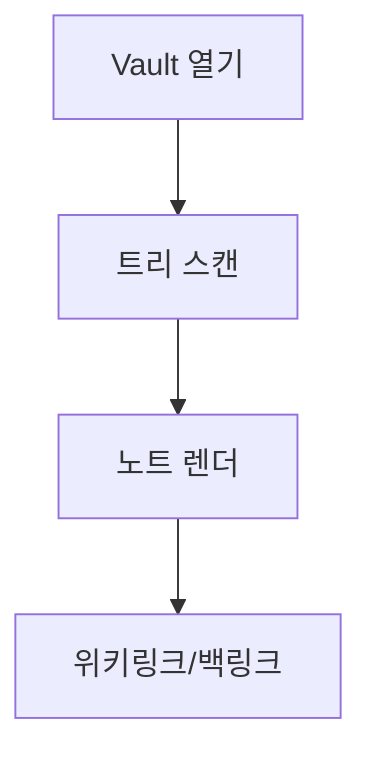
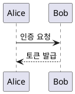

# 다이어그램 데모

4단계에서 아래 fence 들이 실제 그림으로 렌더됩니다. 지금은 코드 블록으로 보입니다.

## Mermaid



## draw.io

```drawio
<mxGraphModel><root><mxCell id="0"/><mxCell id="1" parent="0"/><mxCell id="2" value="시작" style="rounded=1;fillColor=#dae8fc;" vertex="1" parent="1"><mxGeometry x="40" y="40" width="120" height="50" as="geometry"/></mxCell><mxCell id="3" value="끝" style="rounded=1;fillColor=#d5e8d4;" vertex="1" parent="1"><mxGeometry x="240" y="40" width="120" height="50" as="geometry"/></mxCell><mxCell id="4" style="edgeStyle=orthogonalEdgeStyle;" edge="1" parent="1" source="2" target="3"><mxGeometry relative="1" as="geometry"/></mxCell></root></mxGraphModel>
```

## D2

```d2
서버 -> DB: 쿼리
DB -> 서버: 결과
```

## PlantUML

> PlantUML 은 Java 기반이라 `tools/` 에 JRE + plantuml.jar 반입 후 동작합니다
> (자세히는 tools/README.md). 미반입 시 안내 메시지가 표시됩니다.



[[Welcome]] 로 돌아가기
