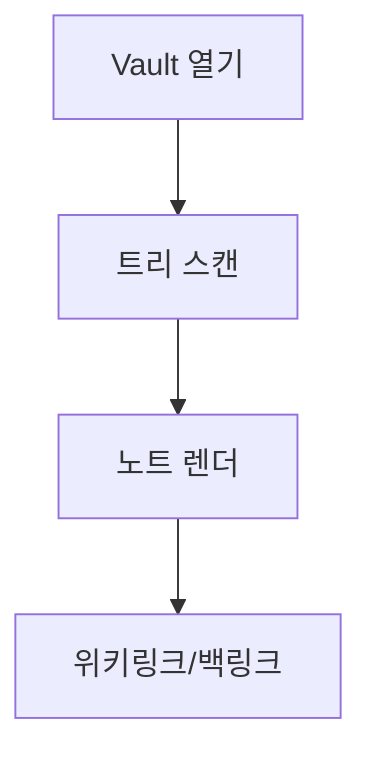

# 다이어그램 데모

4단계에서 아래 fence 들이 실제 그림으로 렌더됩니다. 지금은 코드 블록으로 보입니다.

## Mermaid


```mermaid
graph TD
  A[Vault 열기] --> B[트리 스캔]
  B --> C[노트 렌더]
  C --> D[위키링크/백링크]
```

## D2

```d2
서버 -> DB: 쿼리
DB -> 서버: 결과
```

[[Welcome]] 로 돌아가기
